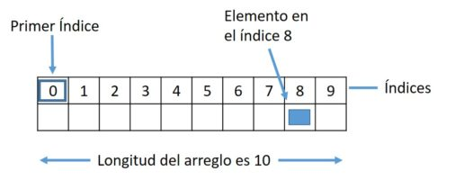
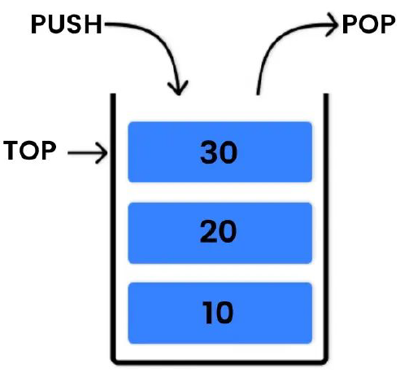
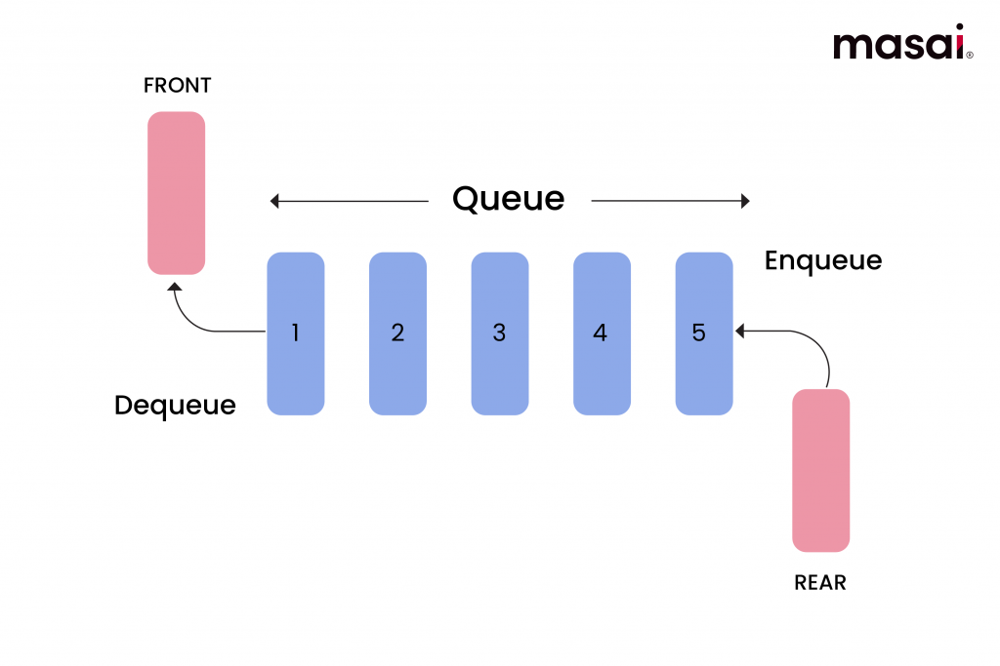
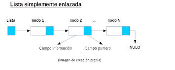
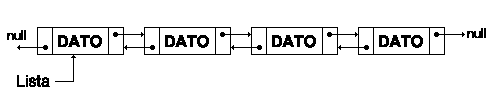
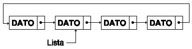
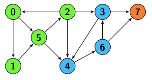
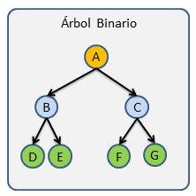
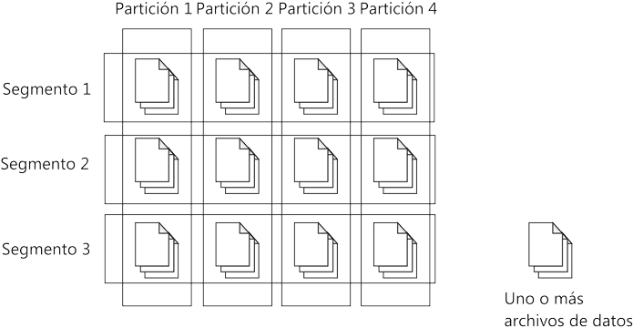
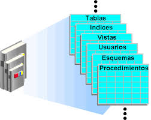

# Esctructura de Datos  

Es una forma de organizar, almacenar y manipular datos en un sistema informático para que sean accesibles y procesables de manera eficiente.

A continuación veremos las estructuras más comunes que son:  

**Lineales**
- Arreglo
- Pila 
- Cola
- Lista 
  - Simple
  - Doble 
  - Circular  

**No lineales**
- Grafos
- Arboles

**Abstractas**
- Conjunto
-  Diccionario

># Lineales  
 ## Arreglos  
Un arreglo es una estructura de datos fundamental que almacena una colección de elementos del mismo tipo en posiciones consecutivas de memoria.

**Características**
- Almacenamiento Contiguo
- Tamaño Predefinido
- Todos los elementos deben ser del mismo tipo de dato
 

 ## Pilas 
Una pila es una estructura de datos lineal que sigue el principio *LIFO (Last-In, First-Out)*, lo que significa que el último elemento en entrar es el primero en salir.

**Características**
- Push: Insertar un elemento en la parte superior de la pila
- Pop: Eliminar y retornar el elemento superior de la pila
- Peek: Observar el elemento superior sin eliminarlo

## Colas
Es una estructura de datos lineal que sigue el principio *FIFO (First-In, First-Out)*, lo que significa que el primer elemento en entrar es el primero en salir.

**Características**
- Enqueue: Insertar un elemento al final de la cola
- Dequeue: Eliminar y retornar el elemento del frente de la cola
- Front/Peek: Observar el elemento frontal sin eliminarlo

## Listas
Una lista es una estructura de datos lineal que almacena una colección ordenada de elementos que pueden ser accedidos secuencialmente o por posición.

**Características**
- Cada elemento tiene una posición o índice
- Requieren que todos los elementos sean del mismo tipo
- No requiere definir un tamaño máximo inicial
- Se pueden agregar elementos en cualquier posición
- Se pueden eliminar elementos desde cualquier posición

 ### *Tipos*
 ##### Simple
- Cada nodo apunta al siguiente
- Recorrido solo en una dirección
- Inserción/eliminación eficiente al inicio

##### Doble
- Cada nodo apunta al anterior y al siguiente
- Recorrido bidireccional
- Mayor flexibilidad pero más memoria

##### Circular
- El último nodo apunta al primero
- Útil para aplicaciones circulares
- Recorrido continuo

># No lineales  
## Grafos
Son estructuras de datos compuestas por nodos (o vértices) y aristas (o arcos) que conectan pares de nodos, usados para modelar relaciones entre conjuntos de datos

**Características**
- Los elementos pueden tener múltiples conexiones
- No existen restricciones en las conexiones
- Se pueden agregar/eliminar vértices y aristas fácilmente

## Arboles
Consiste en nodos conectados por aristas, donde un nodo específico se designa como raíz y los demás nodos forman subárboles disjuntos.

**Características**
- Existe un nodo raíz en el nivel superior
- Relaciones padre-hijo entre nodos
- Múltiples caminos posibles desde la raíz
- Nodo superior sin padre

># Abstractas
## Conjunto
Es una estructura de datos que almacena una colección de elementos únicos sin un orden específico. No permite elementos duplicados y se enfoca en operaciones de pertenencia y relaciones entre conjuntos.

**Características**
- No se permiten elementos duplicados
- Cada elemento aparece una sola vez
- El orden puede variar entre diferentes implementaciones
- Operaciones de búsqueda muy rápidas

## Diccionario
Es una estructura de datos que almacena pares clave-valor, donde cada clave única está asociada a un valor específico. También conocido como mapa, tabla hash o array asociativo.

**Características**
- La clave actúa como identificador único
- Si se agrega clave existente, se sobrescribe el valor
- Acceso rápido a valores mediante su clave
- Los elementos no tienen orden garantizado

